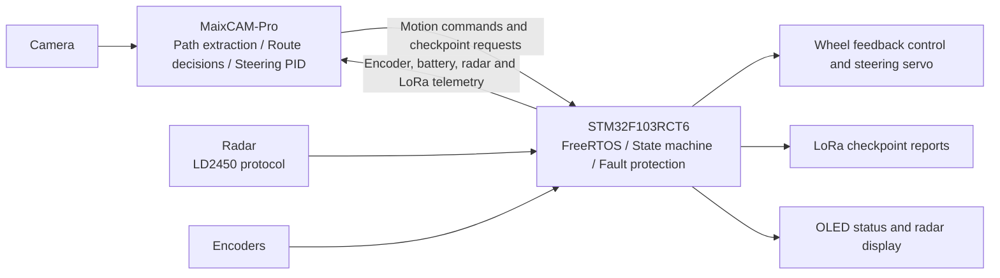

# Vision-Guided Line-Following Robot

**STM32 real-time control × MaixCAM vision × Sensor integration**

[中文](README.md) | English

An autonomous line-following robot built with STM32F103RCT6, FreeRTOS and MaixCAM-Pro. The camera extracts track candidates; the vision controller selects a route and produces motion commands. The MCU handles wheel feedback, steering, radar telemetry and LoRa checkpoint reporting.

**Independently developed and integrated by Cevlan, with a complete physical track run confirmed by the author.** This repository includes the current MaixCAM implementation, MCU firmware, host tests and the earlier OpenMV approach.

[Architecture](docs/architecture.md) · [Hardware](docs/hardware.md) · [Build and deployment](docs/getting-started.md) · [Validation](docs/validation.md) · [Resume notes](docs/resume.md) — detailed guides are in Chinese; reproducible build commands are included below.

## Outcomes and responsibilities

- Implemented and integrated vision processing, route decisions, chassis control, device communication and vehicle testing.
- Built black-line tracking, complex-zone route selection, visual checkpoint detection, radar-assisted obstacle decisions and finish stopping.
- Preserved host tests and Debug / Release build presets. Physical track completion is an author-reported result; software verification is documented separately.

## Architecture



MaixCAM makes route decisions, while STM32 independently enforces command timeout, motion limits and finish stopping. Route scoring targets a fixed left-layout course and tracks the line center; this is not a general-purpose navigation stack.

## Engineering highlights

| Area | Implementation | Source |
| --- | --- | --- |
| Vision | Multiple scan bands, adaptive LAB thresholds, white-background constraints and zone-aware candidate scoring | [Vision pipeline](vision/maixcam/main.py) |
| Motion | Zone-dependent steering PID combining lateral and preview errors; encoder feedback, inner-wheel slowdown and servo steering | [Planner](vision/maixcam/main.py), [kinematics](firmware/stm32/App/Src/ax_kinematics.c) |
| Scheduling | Separate FreeRTOS chassis and application tasks; configured 20 ms chassis period | [Tasks](firmware/stm32/Core/Src/freertos.c), [chassis loop](firmware/stm32/App/Src/ax_robot.c) |
| Communication | 115200 8N1 UART, CRC16-CCITT, command and telemetry frames, receive restart after UART errors | [Codec](firmware/stm32/App/Src/maix_link_protocol.c), [link](firmware/stm32/App/Src/maix_link.c) |
| Sensor integration | Visual post-corridor checkpoints, radar-based obstacle-side decisions and LoRa Fixed Mode reports | [Radar](firmware/stm32/App/Src/radar.c), [LoRa](firmware/stm32/App/Src/lora.c) |
| Fault handling | Configured 150 ms command timeout, speed/steering limits, finish stopping and distinct link/command fault indications | [State machine](firmware/stm32/App/Src/app_state.c), [configuration](firmware/stm32/App/Inc/app_config.h) |

Periods and thresholds describe configured behavior, not measured timing guarantees. Vision uses conventional image processing and requires no trained model weights.

## Repository layout

```text
firmware/stm32/   MCU application, CubeMX project, CMake and IDE configuration
vision/maixcam/   Current vision controller and application manifest
legacy/openmv/   Historical scripts, inactive MCU modules and protocol notes
docs/            Architecture, hardware, setup, validation and archived materials
tests/           Python regression tests and native C protocol tests
CONTEXT.md       Development context
```

## Quick start

Install Git, Python 3, CMake 3.22+, Ninja and an ARM GNU toolchain with newlib-nano. Put their executables on `PATH`. Verified versions: Python 3.14, CMake 4.2.3, Ninja 1.13.2 and ARM GCC 14.3.1.

```sh
git clone https://github.com/Cevlan258/Track-line-Car.git
cd Track-line-Car
python -B -m unittest discover -s tests -p "*_test.py"

cd firmware/stm32
cmake --preset Debug
cmake --build --preset Debug
cmake --preset Release
cmake --build --preset Release
```

Outputs are `firmware/stm32/build/{Debug,Release}/CAR_FIRST.elf`. Open `firmware/stm32/` as the STM32 IDE workspace and use its `CAR_FIRST.ioc` for CubeMX. The compiler target remains `CAR_FIRST`.

For the native C tests, return to the repository root and use a **host** C compiler, such as MSVC or GCC, with CMake:

```sh
cmake -S tests -B build/host
cmake --build build/host --config Debug
ctest --test-dir build/host -C Debug --output-on-failure
```

Open `vision/maixcam/` in MaixVision, connect a MaixCAM-Pro running MaixPy and run the project on the device. Its `app.yaml` supports packaging and installation. Host tests use stubs and do not require MaixPy. See the [deployment guide](docs/getting-started.md) for wiring, installation references and commissioning steps.

## Validation

| Check | Result | Evidence boundary |
| --- | --- | --- |
| Full physical track | Completed | Author confirmation; no video or timing log included yet |
| Python regression | 39 passing tests | Policy behavior and static firmware checks |
| Native C protocol | Passed | Command round trip, corrupted CRC rejection and telemetry layout |
| Debug / Release firmware | Both built successfully | ARM GCC 14.3.1, fresh build directories |

The reorganization did not include flashing, a new physical run or a CubeMX GUI regeneration check. Host tests and compilation do not establish hardware runtime performance. See [validation details](docs/validation.md).

## History and licensing

The [OpenMV archive](legacy/openmv/README.md) is not part of the active build. [Archived requirements and BOM](docs/archive/README.md) are historical references, not the current wiring specification.

STM32 HAL, CMSIS and FreeRTOS retain their own license files. No repository-wide open-source license has been declared for the author's code; third-party licenses do not automatically cover the entire project.
