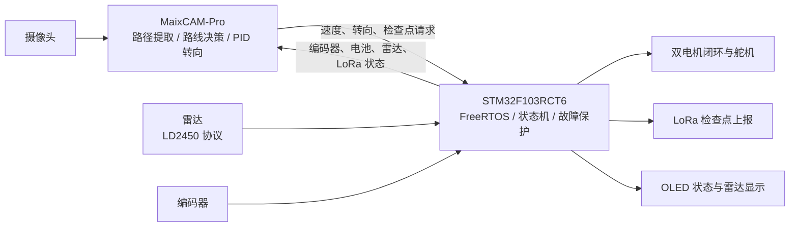

# 智能视觉巡线小车

**STM32 实时控制 × MaixCAM 视觉决策 × 多传感器协同**

中文 | [English](README.en.md)

基于 STM32F103RCT6、FreeRTOS 与 MaixCAM-Pro 的自主巡线小车：从摄像头提取赛道路径，在复杂区域选择行驶方向，结合编码器与雷达信息下发运动指令，并在指定检查点通过 LoRa 发送任务信息。

项目由 **Cevlan 独立完成开发与整车集成，已完成完整赛道实车运行**。仓库保留当前 MaixCAM 方案、STM32 固件、自动化测试及早期 OpenMV 方案，便于理解系统演进和复现开发环境。

[系统架构](docs/architecture.md) · [硬件连接](docs/hardware.md) · [构建与部署](docs/getting-started.md) · [验证记录](docs/validation.md) · [简历项目描述](docs/resume.md)

## 项目成果与职责

- 独立完成视觉感知、路线决策、底盘控制、设备通信与整车联调，打通“感知 → 决策 → 执行 → 遥测”闭环。
- 实现黑线巡线、复杂区域路径选择、视觉拱门检查点识别、雷达辅助避障和终点停车；实车完整赛道运行结果由项目作者确认。
- 保留可在电脑运行的策略及协议测试，并提供 Debug / Release 固件构建入口。软件验证与实车运行结论分别记录，不将控制参数当作实测性能。

## 系统架构



MaixCAM 负责路径与任务决策；STM32 保持独立的命令超时停车、速度限幅和终点停车逻辑。当前策略针对固定左版赛道拓扑，跟踪目标仍为黑线中心，不是任意地图通用导航。

## 技术亮点

| 模块 | 实现要点 | 代码入口 |
| --- | --- | --- |
| 视觉路径选择 | 多水平扫描带、动态 LAB 阈值、白底约束、候选路径连接和分区评分 | [MaixCAM 主程序](vision/maixcam/main.py) |
| 转向与底盘控制 | 结合偏移和预瞄量的分段 PID、双电机编码器反馈、转弯内轮减速与舵机控制 | [转向策略](vision/maixcam/main.py)、[底盘运动控制](firmware/stm32/App/Src/ax_kinematics.c) |
| 实时任务 | FreeRTOS 分离底盘周期任务与应用状态任务，底盘配置周期为 20 ms | [任务创建](firmware/stm32/Core/Src/freertos.c)、[底盘任务](firmware/stm32/App/Src/ax_robot.c) |
| 双向通信 | 115200 8N1 UART、CRC16-CCITT、命令帧与遥测帧、串口错误后重启接收 | [协议实现](firmware/stm32/App/Src/maix_link_protocol.c)、[链路处理](firmware/stm32/App/Src/maix_link.c) |
| 任务协同 | 视觉立柱走廊触发检查点；雷达目标参与障碍侧别决策；LoRa Fixed Mode 上报 | [雷达解析](firmware/stm32/App/Src/radar.c)、[LoRa](firmware/stm32/App/Src/lora.c) |
| 故障保护 | 命令超时阈值 150 ms、速度与转向限幅、终点停车、区分链路故障与主动故障 | [应用状态机](firmware/stm32/App/Src/app_state.c)、[参数配置](firmware/stm32/App/Inc/app_config.h) |

以上周期、波特率和阈值均为代码配置值；测试范围见[验证记录](docs/validation.md)。视觉算法使用传统图像处理，没有训练模型或模型权重依赖。

## 目录导航

```text
.
├── firmware/stm32/     STM32 固件、CubeMX 工程、CMake 与 IDE 配置
│   ├── App/           应用状态机、通信、底盘控制与显示
│   ├── Core/          外设初始化、中断与 FreeRTOS 任务
│   ├── Drivers/       STM32 HAL 与 CMSIS
│   └── Middlewares/   FreeRTOS
├── vision/maixcam/     当前视觉与路线决策、MaixCAM 应用清单
├── legacy/openmv/     历史 OpenMV 脚本、旧 STM32 实现与协议
├── docs/              架构、硬件、部署、验证与历史资料
├── tests/             Python 回归测试、宿主 C 协议测试
└── CONTEXT.md         开发上下文与维护约定
```

## 快速开始

准备 Git、Python 3、CMake 3.22+、Ninja 和包含 newlib-nano 的 ARM GNU 工具链，将相应可执行文件加入 `PATH`。本次验证工具版本见[完整指南](docs/getting-started.md)。

```sh
git clone https://github.com/Cevlan258/Track-line-Car.git
cd Track-line-Car
python -B -m unittest discover -s tests -p "*_test.py"

cd firmware/stm32
cmake --preset Debug
cmake --build --preset Debug
```

产物：`firmware/stm32/build/Debug/CAR_FIRST.elf`。Release 构建将上述两条命令的 `Debug` 替换为 `Release`。

STM32CubeIDE / VS Code 开发时直接打开 `firmware/stm32/`，CubeMX 工程为其中的 `CAR_FIRST.ioc`。MaixVision 打开 `vision/maixcam/`，在设备上运行或打包安装应用；电脑端测试无需安装 MaixPy。接线、部署与宿主 C 测试命令见[构建与部署](docs/getting-started.md)。

## 验证情况

| 项目 | 结果 | 依据 |
| --- | --- | --- |
| 完整赛道实车运行 | 已完成 | 作者确认；仓库尚未附实车录像或计时记录 |
| Python 回归 | 39 项通过 | 策略行为测试与固件源码静态检查 |
| C 协议测试 | 通过 | 命令往返、CRC 损坏拒绝、遥测布局校验 |
| 固件 Debug / Release | 构建通过 | ARM GCC 14.3.1，全新构建目录 |

本次目录整理未重新烧录、进行实车复测或执行 CubeMX 图形界面再生成。构建和宿主测试不能替代设备端验证。详情见[验证记录](docs/validation.md)。

## 历史方案与第三方代码

[OpenMV 历史方案](legacy/openmv/README.md)用于展示开发过程，不参与当前固件构建。[历史需求与 BOM](docs/archive/README.md)不作为当前接线依据。

STM32 HAL、CMSIS 和 FreeRTOS 随源码保留各自的许可证文件。本仓库尚未为作者自有代码声明统一开源许可证，第三方许可不自动适用于全部项目代码。
